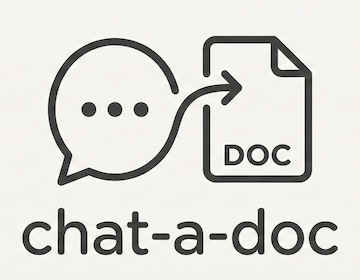

# Chat-A-Doc

Some AI clients lack native support for generating documents for export. Chat-a-doc fills that gap by providing a secure MCP server that generates documents directly from chat conversations. Simply make a request (e.g., "Create a research report on X"), wait for the AI to present template options (for DOCX and PDF formats), and you'll receive a link (optionally HTTP) to download your document. Need to make edits? Ask the model and a new document will be generated. Uses lightweight, purpose-built document conversion libraries (from markdown) and allows users to import custom DOCX and PDF templates to suit their personal style or business needs.

Credit: This setup was originally based on `mcp-pandoc` by [vivekVells](https://github.com/vivekVells/mcp-pandoc). Pandoc was removed in favor of lighter weight libraries, while maintaining the MCP portion.

--- 

## UX + Use Cases

### Basic UX

User: 
> Provide a report on the nutritional benefits of bananas as a [x format] document.

AI: [if docx or pdf]
> Please select from the available templates:  
> A. journal.xxx  
> B. modern.xxx  
> C. research.xxx  

User: 
> A

AI: [paraphrasing]
> Your banana benefits report is ready!
> [File: Banana Benefits: Nutritional Powerhouse]()
> Let me know if you'd like any adjustments!

[if using http links, the browser opens with prompt to download locally]

For csv, md, html and txt formats, templates will not be presented.

### Some Use Cases

#### General Doc generation from chat
- Summarize a chat for download to your favorite notes app
- Convert an AI generated comparison table into an embeddable element for a Word doc

#### Data extraction and conversion
- Extract a comparison table from a discussion and export as csv for use as a spreadsheet.
- Compile statistics on a domain and export for use in a spreadsheet
- Export metrics to CSV for analysis in any app

#### Template-based professional documents
- Generate a meeting summary as PDF with corporate style template to share with stakeholders and RAG repository
- Generate an action plan to share with project collaborators
- Convert technical documentation to PDF for upload to knowledgebase
- Collaborate with AI on a business proposal and export to Word for final finessing.
- Work with AI to refine a blog post then convert to HTML for publishing

## Features

### Document Generation
- **Multiple Formats**: PDF, DOCX, HTML, Markdown, TXT, CSV
- **Word Templates**: Interactive template selection (A, B, C...) with automatic styling application
- **PDF Templates**: Optional CSS-based templates for custom PDF styling (corporate, modern, academic examples included)
- **Auto-filenames**: Intuitive, content-based file naming by AI model
- **HTTP File Links**: Clickable HTTP links for generated files (optional for chat clients w/ local file linking disabled)

### CSV Generation
- **Custom Implementation**: Extracts tables from markdown and converts to CSV format
- **Table Data Extraction**: Extracts table data from markdown tables or HTML tables in input
- **Security**: Formula injection protection (see Security section)

### Effective Tool Instructions
- **Comprehensive Documentation**: Detailed parameter descriptions and usage examples
- **Title Requirements**: Guidance for generating meaningful document titles
- **Template Concierge**: Guidance for offering template selection options

### Supported Formats
- **HTML**: Generated from markdown using python-markdown
- **TXT**: Generated from markdown using python-markdown + html2text
- **MARKDOWN**: Pass-through (validates and normalizes)
- **CSV**: Extracts tables from markdown and converts to CSV
- **PDF**: Generated from markdown using python-markdown + WeasyPrint
- **DOCX**: Generated from markdown using python-markdown + python-docx (with template support)

### Security
- **Path Validation**: All operations restricted to `ALLOWED_ROOT` directory (required, enforced at startup)
- **Docker Isolation**: Non-root user, restricted volume mounts, no host root access
- **No External Binaries**: Uses lightweight Python libraries
- **Input Validation**: Comprehensive parameter and format validation
- **HTTP Security**: Path validation on `/files/` endpoint, prevents directory traversal
- **CSV Formula Injection Protection**: Cells starting with =, +, -, @ are sanitized to prevent formula injection attacks

--- 

## Installation: Docker
(See below for env variables)

### Pull from Dockerhub

```bash
docker pull jland3/chat-a-doc:latest
```

### Build Locally

```bash
git clone https://github.com/j-land3/chat-a-doc.git
cd chat-a-doc
docker build -t chat-a-doc .
```

### Run Container

```bash
docker run -d \
  --name chat-a-doc \
  --restart=unless-stopped \
  -p 8080:8080 \
  -v /path/to/output:/app/files \
  -e ALLOWED_ROOT=/app/files \
  -e USE_HTTP_LINKS=true \
  -e HTTP_BASE_URL=http://localhost:8080 \
  jland3/chat-a-doc:latest
```

---

## Installation: Without Docker
(See below for env variables)

**Prerequisites:**
- Python 3.11 (Python 3.12 or 3.13 also work, but 3.11 is recommended)
- System dependencies for WeasyPrint (PDF generation)

**Step 1: Install System Dependencies**

**macOS:**
```bash
brew install cairo pango gdk-pixbuf libffi
```

**Linux (Debian/Ubuntu):**
```bash
sudo apt-get update
sudo apt-get install -y libpango-1.0-0 libpangoft2-1.0-0 libcairo2 libgdk-pixbuf2.0-0
```

**Linux (Fedora/RHEL):**
```bash
sudo dnf install -y pango cairo gdk-pixbuf2
```

**Windows:**
WeasyPrint system dependencies are typically included with Python installations on Windows. If you encounter issues, you may need to install GTK+ for Windows.

**Step 2: Install Python Dependencies**

The project uses `uv` for dependency management (recommended), but you can also use `pip`:

**Using uv (Recommended):**
```bash
# Install uv if you don't have it
curl -LsSf https://astral.sh/uv/install.sh | sh

# Clone the repository
git clone https://github.com/j-land3/chat-a-doc.git
cd chat-a-doc

# Install Python 3.11 (if needed)
uv python install 3.11

# Install dependencies
uv sync
```

**Using pip:**
```bash
# Clone the repository
git clone https://github.com/j-land3/chat-a-doc.git
cd chat-a-doc

# Create a virtual environment (recommended)
python3.11 -m venv venv
source venv/bin/activate  # On Windows: venv\Scripts\activate

# Install dependencies
pip install -e .
```

**Step 3: Create Output Directory**

```bash
# Create a directory for generated files and templates.
mkdir -p ~/your-desired-parent-directory/chat-a-doc-output/templates
```

**Step 4: Run the Server**

**Using uv:**
```bash
export ALLOWED_ROOT=~/your-desired-parent-directory/chat-a-doc-output
export USE_HTTP_LINKS=true #optional
export HTTP_BASE_URL=http://localhost:8080 #optional
uv run python -m chat_a_doc.http_server
```

**Using pip/virtual environment:**
```bash
export ALLOWED_ROOT=~/your-desired-parent-directory/chat-a-doc-output
export USE_HTTP_LINKS=true #optional
export HTTP_BASE_URL=http://localhost:8080 #optional
python -m chat_a_doc.http_server
```

**Windows (PowerShell):**
```powershell
$env:ALLOWED_ROOT="C:\Users\YourName\your-desired-parent-directory\chat-a-doc-output"
$env:USE_HTTP_LINKS="true" #optional
$env:HTTP_BASE_URL="http://localhost:8080" #optional
python -m chat_a_doc.http_server
```
--- 

## Environment Variables

**ALLOWED_ROOT**
- Root directory for container and path where docs will be saved
- **ALLOWED_ROOT is required** and must match the container path in your volume mount (e.g., `/app/files`)
- Docker requires absolute paths for volume mounts. Use `$HOME` (expands in shell) or provide full absolute path. `~` tilde expansion doesn't work in Docker volume mounts.
- **Example: Local desktop (macOS/Linux):** `$HOME/Documents/output:/app/files` (or `/Users/username/Documents/chat-a-doc/files:/app/files` - replace `username` with your actual username)
- **Example: Local desktop (Windows):** `C:\Users\YourName\Documents\chat-a-doc\files:/app/files`
- **Example: Remote server (Generic Linux):** `/var/lib/chat-a-doc/files:/app/files`
- **Example: Remote server (Synology):** `/volume1/docker/chat-a-doc/files:/app/files`

> ⚠️ **Security Considerations:**
> - Avoid mounting sensitive directories such as:
>   - `$HOME/.ssh`, `$HOME/.config`, `$HOME/Desktop` (local)
>   - System directories like `/etc`, `/home`, `/root` (server)
> - Only mount what the container needs access to

**HTTP_PORT**  
- **Port**: Default `8080` (internal port configurable via `HTTP_PORT`). If host port 8080 is in use, map to different port: `-p 8087:8080`

**USE_HTTP_LINKS**  
Optional: If chat client does not support links to local paths, set `USE_HTTP_LINKS=true`. The user will be presented an HTTP link to their doc (e.g., `http://localhost:8080/files/document.pdf`), opening their default browser and prompting to save the doc locally.

**HTTP_BASE_URL**  
Optional: Base URL for HTTP file links. If `USE_HTTP_LINKS=true`, set an access URL (e.g., `http://localhost:8080` or `http://your-server-ip:8080` for remote servers). Must match the machine's IP and the configured port.

**LINK_ROOT**  
An optional environment variable. If your chat client is capable of generating links to local paths, and when *not using* `USE_HTTP_LINKS`, this will ensure the correct file path is returned to users.

- Use Cases
    - Local: If set to: `/Users/harry/Documents/output`, resulting link is: `file:///Users/harry/Documents/output/document.pdf`
    - Network shares: Define SMB/network paths
        - `LINK_ROOT=smb://server/share/chat-a-doc/docs`
        - `LINK_ROOT=//server/share/chat-a-doc/docs`

**PYTHONUNBUFFERED**  
Set to `1` for real-time output. Already set in pre-built container. Should be manually added for all other installs.

--- 

## Dependencies

**Core Libraries:**
- `mcp>=1.2.1` - Model Context Protocol server
- `markdown>=3.5` - Markdown parsing and HTML generation
- `html2text>=2024.2.26` - HTML to text conversion
- `weasyprint>=60` - PDF generation from HTML
- `python-docx>=1.1` - DOCX document generation

**System Dependencies:**
- Cairo, Pango, GDK-Pixbuf (for WeasyPrint PDF generation)

For a complete list, see `pyproject.toml`.

--- 

## Templates
Chat-a-doc supports MS Word and PDF templates. Templates should be placed in the `templates/` subdirectory of your mounted volume. For example, if your volume mount is `/path/to/output:/app/files`, place templates in `/path/to/output/templates/`.

**Note:** DOCX and PDF formats require templates. At least one DOCX template is required for DOCX generation, and at least one PDF (CSS) template is required for PDF generation.

**Starter Templates:**
To get started with templates, a few are provided in `starter_templates/` to be copied to `ALLOWED_ROOT/templates/`.

**Word Templates**
1. Create a document with your desired styling in Microsoft Word or LibreOffice. Modify styles (Normal, Heading 1, Heading 2, etc.), fonts, margins, colors, headers, footers as desired.
2. **IMPORTANT:** After styling your document, you must remove **ALL** content from the template before saving to the `/templates` directory. This includes all text, body paragraphs, tables, header text, footer text, and any other content elements. It's recommended to keep a copy (with all text) in case you want to change the style later.
3. Save the (emptied) file as `.docx` (not `.dotx`) to the templates directory
4. The template will automatically appear in the template list the next time a user chats a doc.

**PDF Templates**
PDF templates use CSS files to customize the styling of generated PDF documents. **CSS templates are REQUIRED for PDF generation** - you must select a template when generating PDFs. Use web-safe fonts or provide fallback font stacks for best compatibility.

**Example CSS Template Structure:**
```css
@page {
    size: A4;
    margin: 1in;
}
body {
    font-family: Arial, sans-serif;
    font-size: 12pt;
    color: #333333;
}
h1 {
    color: #0066cc;
    font-size: 24pt;
}
```
---

## MCP Config

The container exposes an HTTP endpoint. Configure your MCP client based on its capabilities:

#### Option 1: Direct HTTP Connection (for HTTP-native clients):
```json
{
  "url": "http://localhost:8080"
}
```

#### Option 2: Using mcp-remote (for stdio-based clients):

If your MCP client requires stdio connections, use `mcp-remote` to bridge HTTP to stdio:

```json
{
  "command": "npx",
  "args": [
    "-y",
    "mcp-remote",
    "http://localhost:8080",
    "--allow-http"
  ],
  "env": {}
}
```
**Important:** The `--allow-http` flag is required for non-HTTPS URLs, and the URL must come *before* the `--allow-http` flag.

#### Option 3: stdio via docker exec (for backward compatibility):
```json
{
  "command": "docker",
  "args": ["exec", "-i", "chat-a-doc", "python3", "-m", "chat_a_doc"]
}
```

#### Reverse Proxy with HTTPS (Optional):
The container runs HTTP by default. HTTPS can be added via reverse proxy for additional security, or via a mesh network such as Tailscale which already provides encryption. For reverse proxy, use (Nginx, Traefik, Caddy, ...) in front of the container. Example:

```nginx
# Nginx example configuration
location /chat-a-doc {
    proxy_pass http://localhost:8080;
    proxy_http_version 1.1;
    proxy_set_header Host $host;
    proxy_set_header X-Real-IP $remote_addr;
}
```

Then connect via:
```json
{
  "url": "https://your-server.com/chat-a-doc"
}
```
--- 

## Model Selection
Use chat-a-doc with a model that's proficient in tool calling. Here are top picks according to the latest leaderboards.

| Rank | Model | F1 Score |
|------|-------|----------|
| 1 | gpt-4 | 0.974 |
| 2 | qwen3:14B-Q4_K_M | 0.971 |
| 3 | qwen3:14B-Q6_K | 0.943 |
| 4 | claude-3-haiku-20240307 | 0.933 |
| 5 | qwen3:8B-F16 | 0.933 |
| 6 | qwen3:8B-Q4_K_M | 0.919 |
| 7 | gpt-3.5-turbo | 0.899 |
| 8 | gpt-4o | 0.857 |
| 9 | gpt-4o-mini | 0.852 |
| 10 | claude-3-5-sonnet-20241022 | 0.851 |

--- 

## Troubleshooting

### MCP Client Connection Issues

#### mcp-remote "Invalid URL" Error

If you see an error like `TypeError: Invalid URL` with `input: '--allow-http'`, the argument order is incorrect.

**Fix:** The URL must come before the `--allow-http` flag:

```json
{
  "command": "npx",
  "args": [
    "-y",
    "mcp-remote",
    "http://your-server-ip:8080",  // URL first (delete this comment if pasting)
    "--allow-http"                  // Flag after URL (delete this comment if pasting)
  ],
  "env": {}
}
```

#### mcp-remote Requires --allow-http for HTTP URLs

If you see an error about non-HTTPS URLs not being allowed, add the `--allow-http` flag:

```json
{
  "command": "npx",
  "args": [
    "-y",
    "mcp-remote",
    "http://your-server-ip:8080",
    "--allow-http"
  ],
  "env": {}
}
```

#### Port Mapping Considerations

- Container port: `8080` (internal, configurable via `HTTP_PORT`)
- Host port: May be different (e.g., `8087` if mapped in Docker)
- **Use the host/mapped port** in your client configuration, not the container port

#### Testing Connection

Test the HTTP endpoint directly:

```bash
# Test initialize
curl -X POST http://your-server-ip:8080 \
  -H "Content-Type: application/json" \
  -d '{"jsonrpc":"2.0","id":1,"method":"initialize","params":{"protocolVersion":"2024-11-05","capabilities":{},"clientInfo":{"name":"test","version":"1.0"}}}'

# Test tools/list (after initialize)
curl -X POST http://your-server-ip:8080 \
  -H "Content-Type: application/json" \
  -d '{"jsonrpc":"2.0","id":2,"method":"tools/list","params":{}}'
```

If these work but your client doesn't connect, the issue is likely with the client configuration or mcp-remote setup.

--- 

## Contributing

Contributions welcome!
